

<strong>Qatar University</strong> 
College of Engineering - Department of Computer Science and Engineering 
<strong>CMPS 350 - Web Development</strong>

---

# Assignment 1 - Testing & Grading Sheet

**Student Name:** Hadi Hassan Sleiman
**Student ID:** 202104164
**Date:** March 5, 2026

> **Instructions:** For each item below, take a screenshot and save it inside a `screenshots/` folder using the exact file name shown. The image will render automatically in this document. Resize your browser to the correct screen size before capturing.

---

## 1. Home Page - Small Screen (Mobile)

Resize your browser to **< 768px** width and take a full-page screenshot of `index.html`.

**Expected:** Navigation links stacked vertically, recipe cards in 1 column, sidebar below main content.

Save your screenshot as `screenshots/q1-home-mobile.png`

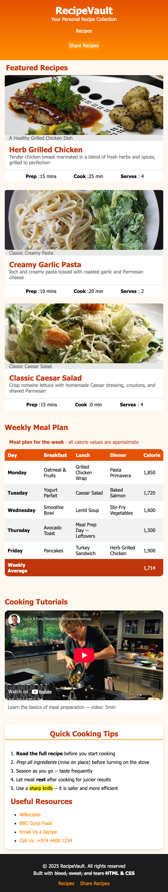

---

## 2. Home Page - Medium Screen (Tablet)

Resize your browser to **768px-1023px** width and take a full-page screenshot of `index.html`.

**Expected:** Navigation links in a row, recipe cards in 2 columns.

Save your screenshot as `screenshots/q2-home-tablet.png`

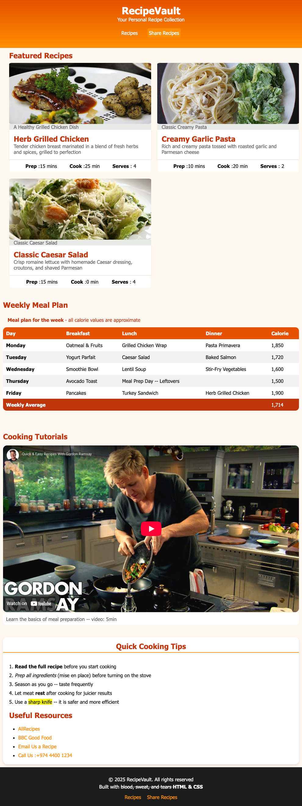

---

## 3. Home Page - Large Screen (Desktop)

Resize your browser to **1024px+** width and take a full-page screenshot of `index.html`.

**Expected:** Header with logo left and nav right, recipe cards in 3 columns, sidebar as a side column.

Save your screenshot as `screenshots/q3-home-desktop.png`

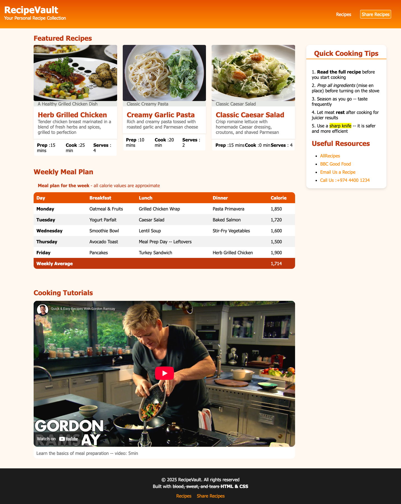

---

## 4. Share Recipe Page

Take a screenshot of the full `share-recipe.html` page.

**Expected:** Same header/footer as home page, form with 2 fieldsets, submit and reset buttons.

Save your screenshot as `screenshots/q4-share-recipe.png`

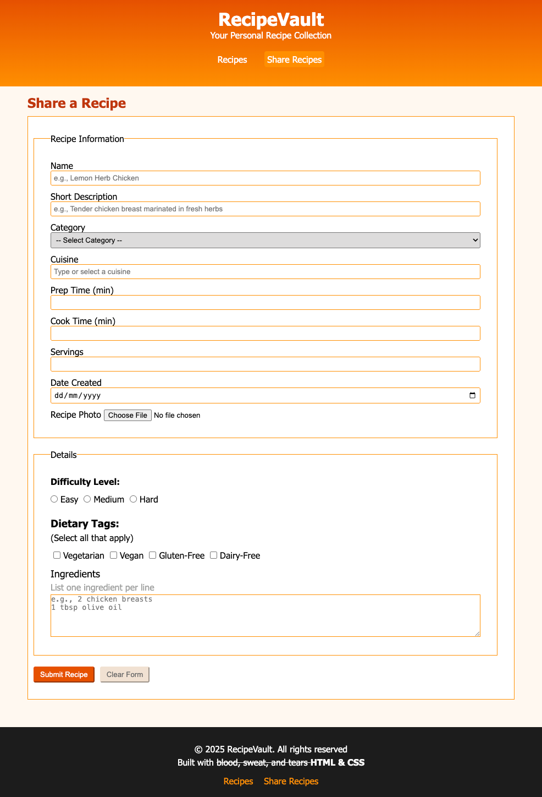

---

## 5. Navigation Between Pages

Take two screenshots showing:

- Clicking "Share Recipe" on `index.html` navigates to `share-recipe.html`
- Clicking "Recipes" on `share-recipe.html` navigates back to `index.html`

Save your screenshots as `screenshots/q5-nav-to-share.png` and `screenshots/q5-nav-to-home.png`

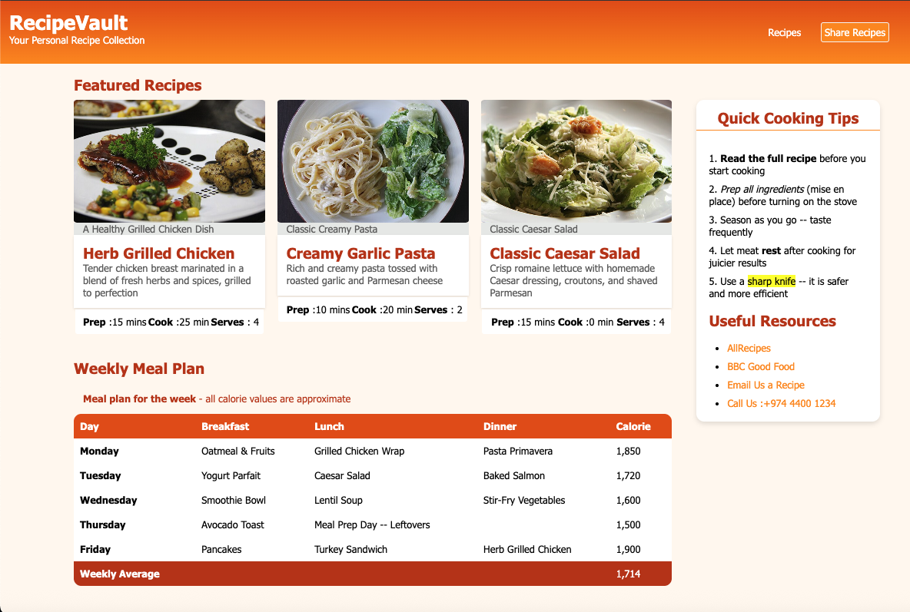
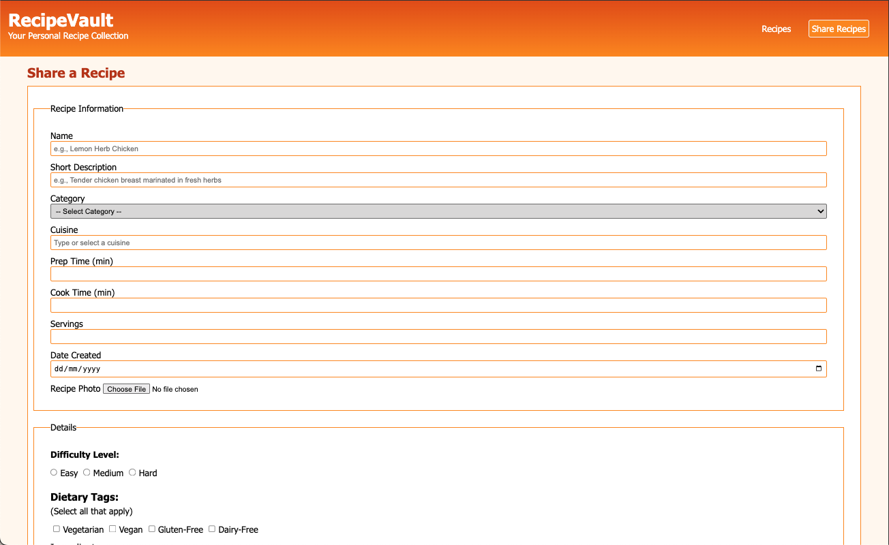

---

## 6. Weekly Meal Plan Table

Take a screenshot of the meal plan table section.

**Expected:** Table with caption, thead, tbody, tfoot, scope attributes, colspan, zebra striping on hover.

Save your screenshot as `screenshots/q6-meal-plan-table.png`

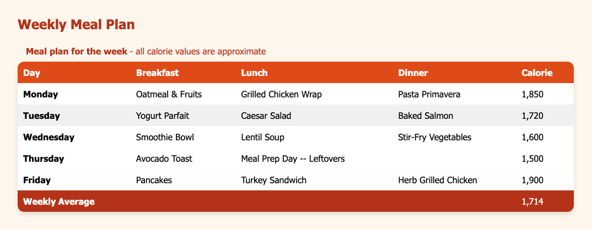

---

## 7. Recipe Cards Hover Effect

Take a screenshot showing a recipe card being hovered (with the card lifted/shadow effect).

Save your screenshot as `screenshots/q7-card-hover.png`

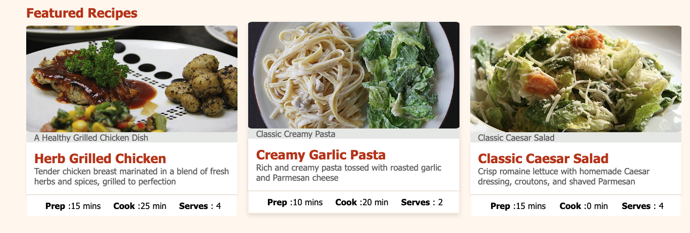

---

## 8. Form Validation

Take a screenshot showing form validation - try submitting the form without filling in the required fields.

**Expected:** Browser shows validation messages for required fields.

Save your screenshot as `screenshots/q8-form-validation.png`

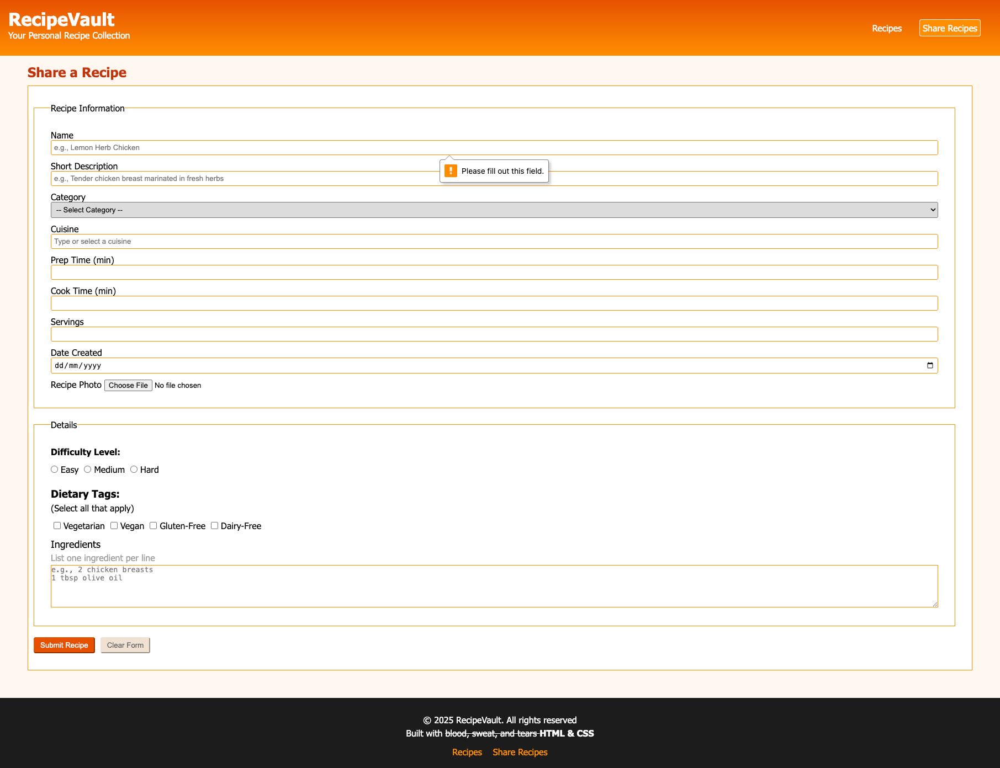

---

## 9. Cooking Tutorial Video

Take a screenshot showing the embedded YouTube video on the home page.

Save your screenshot as `screenshots/q9-video.png`

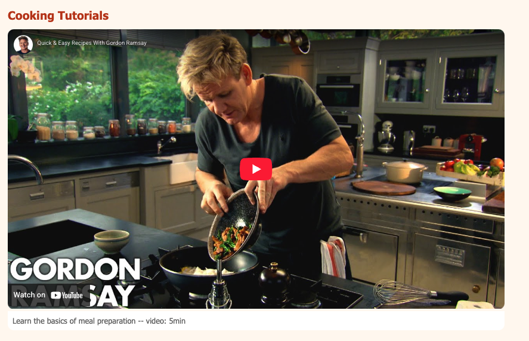

---

## 10. Sidebar

Take a screenshot of the sidebar section showing cooking tips and resource links.

**Expected:** Ordered list of tips, unordered list of links (external, mailto, tel).

Save your screenshot as `screenshots/q10-sidebar.png`

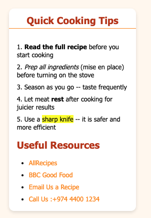

---

## TodaGrading Summary

| #   | Criteria                                                                                                | Points  | Score    |
| --- | ------------------------------------------------------------------------------------------------------- | ------- | -------- |
| 1   | HTML Structure & Semantics - Semantic elements, heading hierarchy, lists, links, images with figures    | 25      | /25      |
| 2   | Tables - caption, thead/tbody/tfoot, th scope, colspan                                                  | 10      | /10      |
| 3   | Forms & Accessibility - Input types, fieldsets, labels, validation, ARIA, multimedia                    | 20      | /20      |
| 4   | CSS Styling - Variables, selectors, box model, typography, colors, backgrounds, pseudo-classes, shadows | 25      | /25      |
| 5   | Responsive Layout - Media queries, Flexbox, Grid, responsive nav/cards/table                            | 20      | /20      |
|     | **Total**                                                                                               | **100** | **/100** |

**Instructor Comments:**

---
