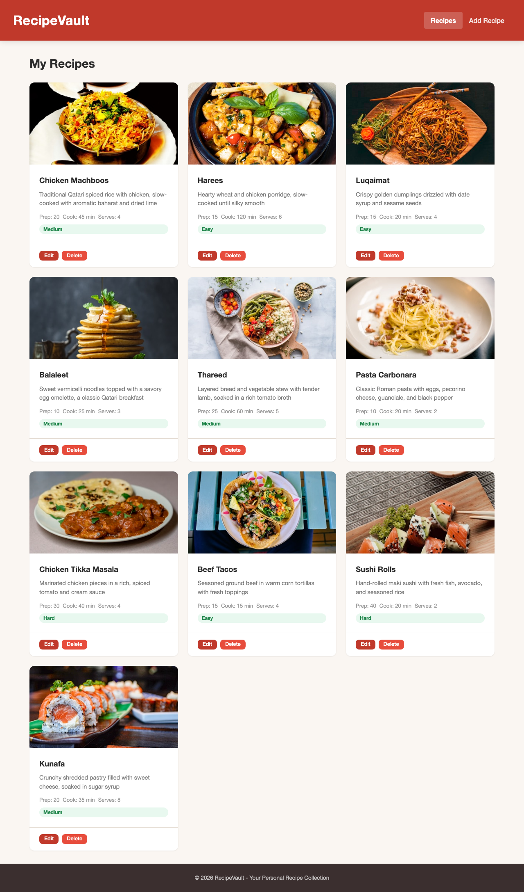
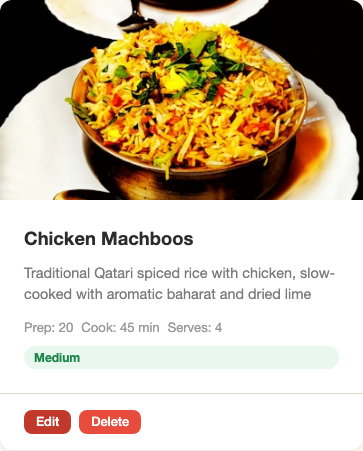
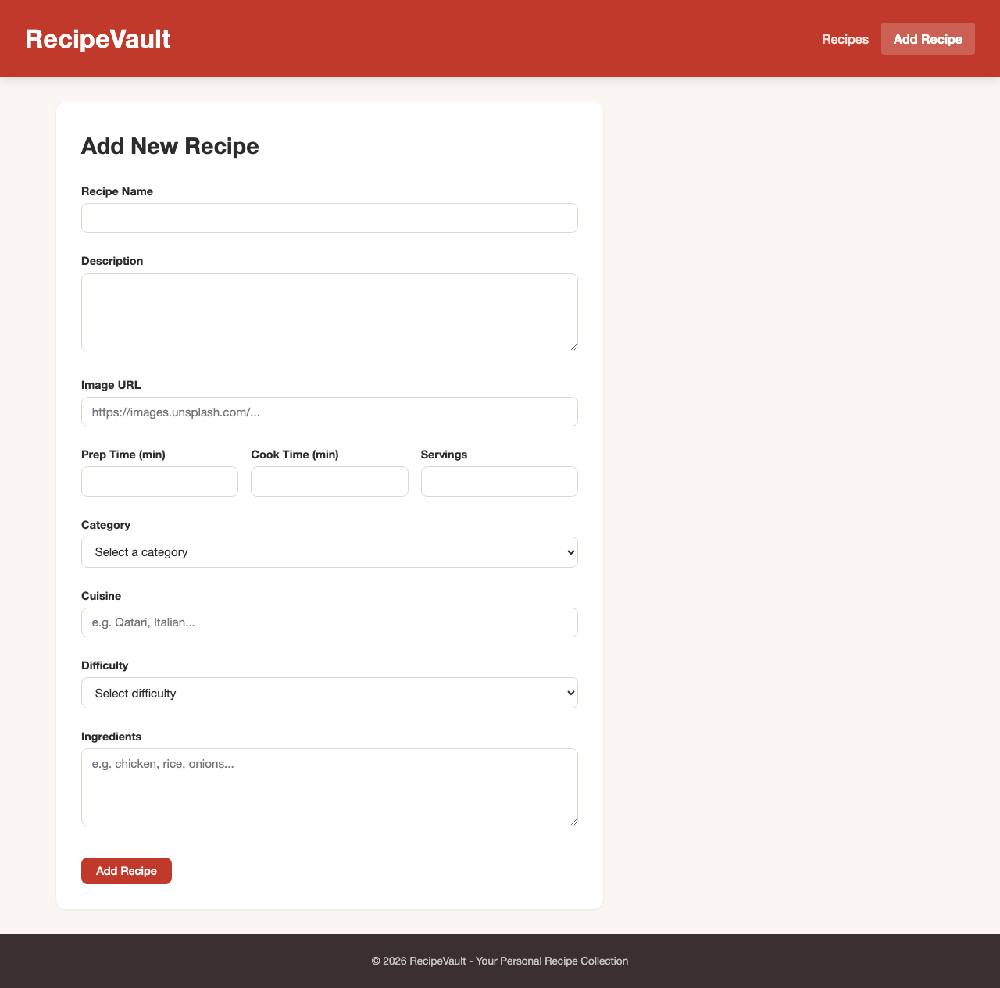
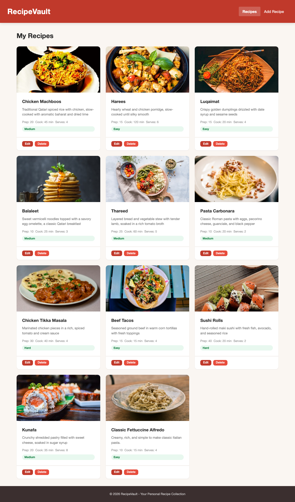
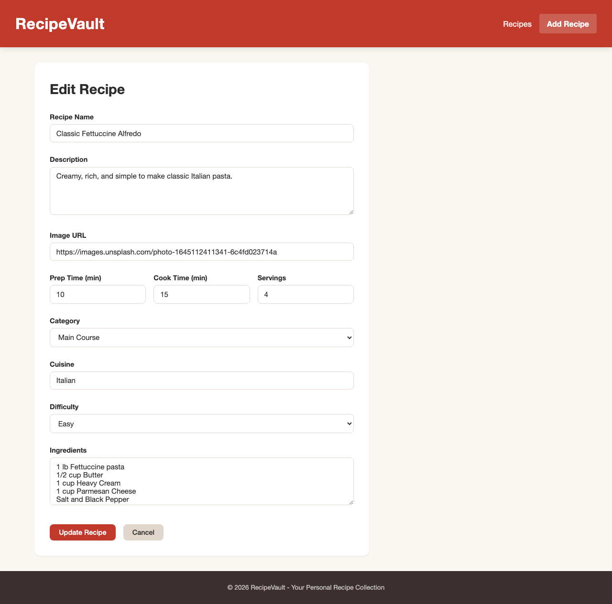
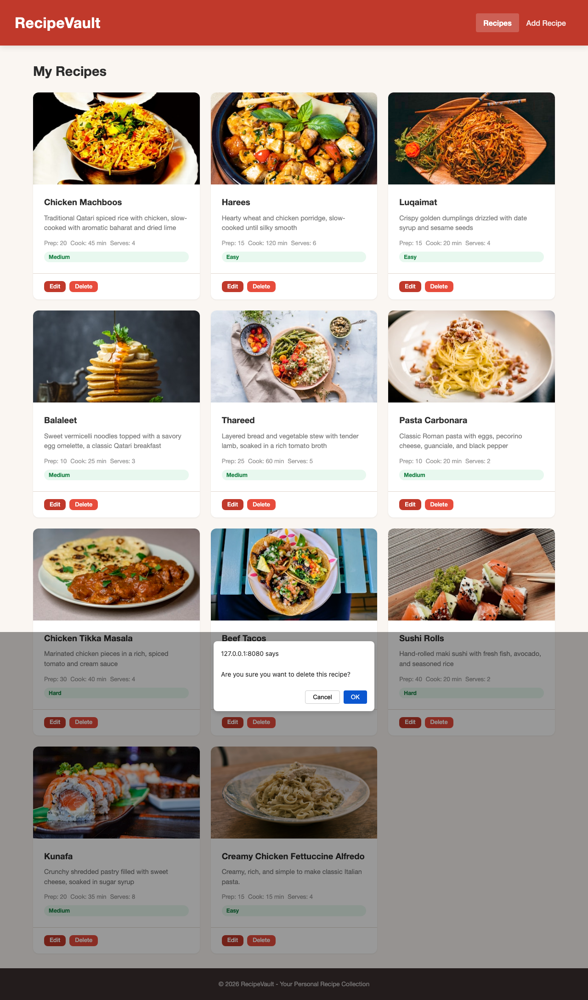

<strong>Qatar University</strong> 
College of Engineering - Department of Computer Science and Engineering 
<strong>CMPS 350 - Web Development</strong>

---

# Assignment 2 - Testing & Grading Sheet

**Student Name:** Hadi Hassan Sleiman
**Student ID:** 202104164
**Date:** March 21, 2026

> **Instructions:** For each item below, take a screenshot and save it inside a `screenshots/` folder using the exact file name shown. The image will render automatically in this document. Open your app with Live Server and test each feature.

---

## 1. Recipes Page - Grid Display

Open the app in your browser. Take a screenshot of the recipes page showing the card grid with all recipes loaded from the API.

**Expected:** Recipe cards displayed in a responsive grid. Each card shows the recipe image, name, description, meta info, difficulty badge, and Edit/Delete buttons.

Save your screenshot as `screenshots/q1-recipes-grid.png`

---

## 2. Recipe Card Details

Take a close-up screenshot of a single recipe card showing all its parts: image, name, description, prep/cook time, servings, difficulty badge, and action buttons.

**Expected:** Card displays all recipe fields with proper formatting.

Save your screenshot as `screenshots/q2-recipe-card.png`

---

## 3. Add Recipe Form

Click "Add Recipe" in the navigation. Take a screenshot of the empty form.

**Expected:** Form with all input fields (name, description, image URL, prep time, cook time, servings, category, cuisine, difficulty, ingredients), an "Add Recipe" button, and no cancel button visible.

Save your screenshot as `screenshots/q3-add-form.png`

---

## 4. Add Recipe - Success

Fill in the form with a new recipe and submit it. Take a screenshot of the recipes page showing your new recipe in the grid.

**Expected:** After submission, the app navigates back to the recipes page and the new recipe appears in the grid.

Save your screenshot as `screenshots/q4-add-success.png`

---

## 5. Edit Recipe - Form Populated

Click the "Edit" button on any recipe card. Take a screenshot of the form populated with that recipe's data.

**Expected:** Form fields filled with the recipe's current values. Title says "Edit Recipe", button says "Update Recipe", and the Cancel button is visible.

Save your screenshot as `screenshots/q5-edit-form.png`

---

## 6. Edit Recipe - Success

Modify one or more fields and submit the form. Take a screenshot of the recipes page showing the updated recipe.

**Expected:** After submission, the app navigates back to the recipes page and the recipe shows the updated information.

Save your screenshot as `screenshots/q6-edit-success.png`

---

## 7. Delete Recipe - Confirmation

Click the "Delete" button on a recipe card. Take a screenshot showing the browser's confirm dialog.

**Expected:** A confirm dialog appears asking "Are you sure you want to delete this recipe?"

Save your screenshot as `screenshots/q7-delete-confirm.png`

---

## 8. Delete Recipe - Success

Confirm the deletion. Take a screenshot of the recipes page showing that the recipe has been removed.

**Expected:** The deleted recipe no longer appears in the grid.

Save your screenshot as `screenshots/q8-delete-success.png`

---

## Grading Summary

| # | Criteria | Points | Score |
|---|----------|--------|-------|
| 1 | API Helper Functions - fetch, POST, PUT, DELETE with proper headers, async/await, try/catch | 15 | /15 |
| 2 | Navigation - loadPage() fetches HTML fragments, injects into #main, wires form handlers | 10 | /10 |
| 3 | Display Recipes - recipeToHTMLCard(), renderRecipes(), loadRecipes() with grid display | 20 | /20 |
| 4 | Add Recipe - form submission with FormData, POST to API, page navigation after add | 20 | /20 |
| 5 | Edit Recipe - populate form from recipe data, PUT to API, editingId pattern, cancel support | 20 | /20 |
| 6 | Delete Recipe - confirm() dialog, DELETE to API, refresh display | 15 | /15 |
| | **Total** | **100** | **/100** |

**Instructor Comments:**

---
