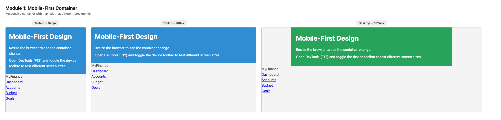
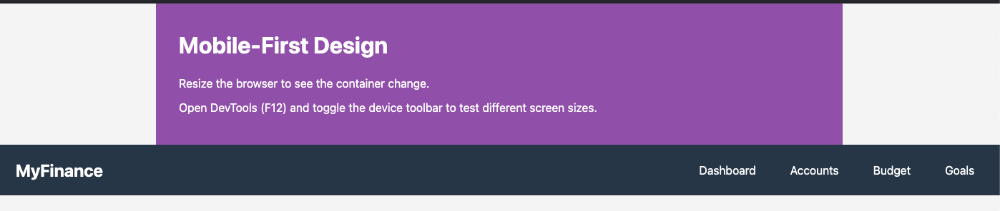
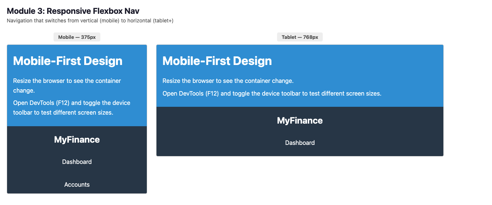
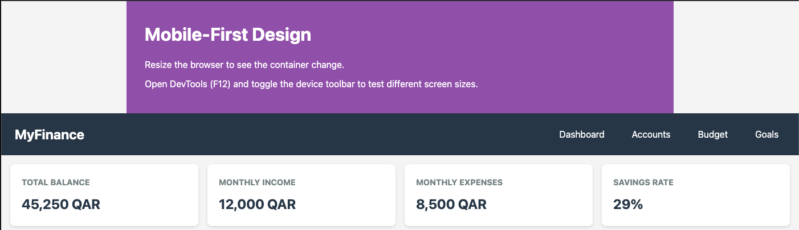
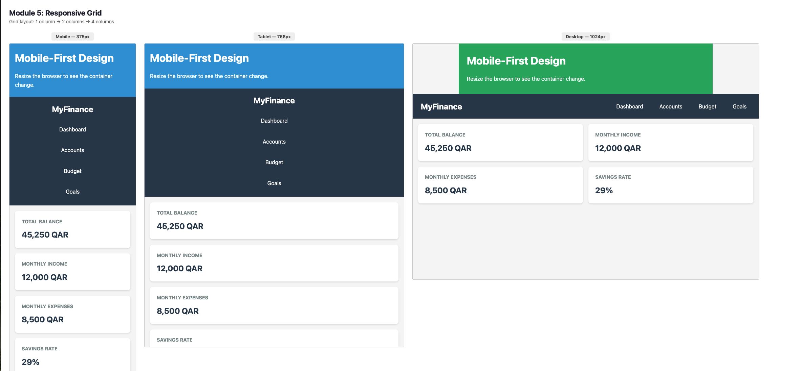
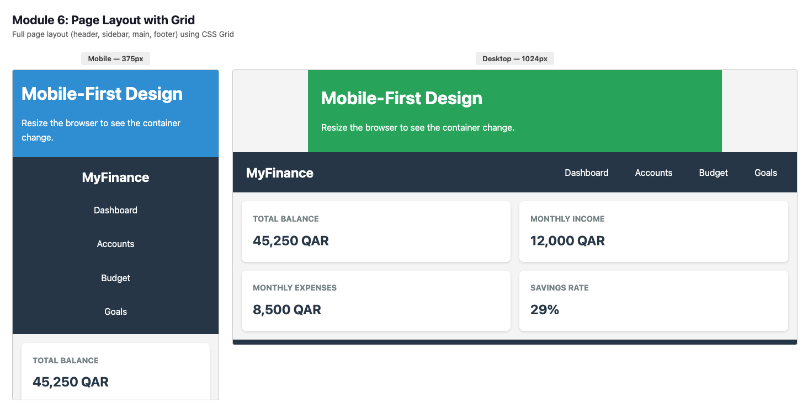

<p align="center">
<strong>Qatar University</strong><br>
College of Engineering - Department of Computer Science and Engineering<br>
<strong>CMPS 350 - Web Development Fundamentals</strong>
</p>

---

# Lab 4: CSS Layouts

# Responsive Finance Dashboard - Mobile-First Design with Flexbox & Grid

**Duration:** 120 minutes
**Type:** Practice Lab (Ungraded)
**Theme:** Personal Finance Platform - Part 4 of 11
**Prerequisites:** Labs 1, 2, and 3 completed

---

## Overview

This lab teaches **CSS Layouts** - the techniques for creating responsive, flexible page structures. You'll learn to use Flexbox for one-dimensional layouts, CSS Grid for two-dimensional layouts, and media queries to adapt your design to different screen sizes.

To apply these concepts practically, you'll transform your styled MyFinance Dashboard into a fully responsive application that works beautifully on mobile phones, tablets, and desktop computers.

This lab completes your CSS foundation, preparing your platform for client-side interactivity with JavaScript in the next labs.

### What You'll Build

A fully responsive MyFinance Dashboard featuring:

- Flexbox navigation that adapts from horizontal to vertical
- CSS Grid dashboard layout (4 columns → 2 → 1)
- Responsive cards that reflow based on screen size
- Mobile-friendly tables with horizontal scroll
- Flexible sidebar (side on desktop, bottom on mobile)
- Touch-friendly buttons and spacing for mobile

### Lab Structure

**Part A: Interactive Layout Basics (60 minutes)**
Instructor demonstrates each concept → You practice immediately → Repeat

**Part B: Make Your Dashboard Responsive (60 minutes)**
Apply all learned concepts to create a mobile-first responsive design

---

## Learning Objectives

By the end of this lab, you will be able to:

- Apply the mobile-first design approach
- Use Flexbox for flexible, one-dimensional layouts
- Use CSS Grid for complex, two-dimensional layouts
- Write media queries for different screen sizes
- Create responsive navigation menus
- Build fluid grid systems
- Make tables responsive on small screens

---

## Prerequisites

- Labs 1, 2, and 3 completed (styled MyFinance Dashboard)
- Understanding of CSS basics (selectors, box model, colors)

---

## Getting Started

1. Copy your Lab 4 : `Lab4-CSS-Layouts into your repo`
2. Open the folder in VS Code
3. Open browser DevTools and enable device toolbar (responsive mode)
4. Test at different screen widths as you work

---

# Part A: Interactive Layout Basics (60 minutes)

## Module 1: Mobile-First Approach (8 minutes)

### Instructor Led (4 minutes)

Demonstrate the mobile-first design philosophy:

<fieldset>
<legend><strong>Mobile-First vs Desktop-First</strong></legend>

**Desktop-First (Old Way):**

```css
/* Start with desktop styles */
.container { width: 1200px; }

/* Then override for smaller screens */
@media (max-width: 768px) {
    .container { width: 100%; }
}
```

**Mobile-First (Modern Way):**

```css
/* Start with mobile styles (default) */
.container { width: 100%; }

/* Then enhance for larger screens */
@media (min-width: 768px) {
    .container { width: 750px; }
}

@media (min-width: 1024px) {
    .container { width: 1000px; }
}
```

</fieldset>

---

**Key Concepts Explained:**

- **Mobile-first** - Write base CSS for mobile, then add complexity for larger screens
- **Progressive enhancement** - Start simple, add features for capable devices
- **`min-width`** - Styles apply when screen is AT LEAST this wide
- **`max-width`** - Styles apply when screen is AT MOST this wide
- **Breakpoints** - Screen widths where layout changes

**Common Breakpoints:**

- Mobile: < 768px (default styles)
- Tablet: 768px - 1023px
- Desktop: 1024px+

### Your Practice Exercise (4 minutes)

**Task:** Create a mobile-first container

Create a new file `layout-practice.html` with basic structure, and `layout-practice.css`:

```css
/* Mobile-first: base styles for small screens */
.container {
    width: 100%;
    padding: 16px;
    background-color: #f0f0f0;
}

/* Tablet and up */
@media (min-width: 768px) {
    .container {
        width: 750px;
        margin: 0 auto;
        padding: 24px;
    }
}

/* Desktop and up */
@media (min-width: 1024px) {
    .container {
        width: 960px;
        padding: 32px;
    }
}
```

**Expected Result:**



Container fills screen on mobile, becomes centered fixed-width on larger screens.

**Self-Check:**

- [X] Container is full-width on mobile (< 768px)
- [X] Container is 750px and centered on tablet
- [X] Container is 960px on desktop
- [X] Padding increases as screen gets larger

---

## Module 2: Flexbox Basics (12 minutes)

### Instructor Led (6 minutes)

Demonstrate Flexbox fundamentals:

<fieldset>
<legend><strong>Flexbox Container and Items</strong></legend>

```css
/* Parent becomes flex container */
.flex-container {
    display: flex;
    flex-direction: row;      /* or column */
    justify-content: center;  /* main axis alignment */
    align-items: center;      /* cross axis alignment */
    gap: 16px;                /* space between items */
}

/* Children become flex items */
.flex-item {
    flex: 1;                  /* grow to fill space equally */
}
```

</fieldset>

**Visual representation:**

```
flex-direction: row (default)
┌─────────────────────────────────────┐
│  [Item 1]  [Item 2]  [Item 3]       │  ← main axis →
└─────────────────────────────────────┘
                ↑ cross axis ↓

flex-direction: column
┌─────────────┐
│  [Item 1]   │  ↑
│  [Item 2]   │  main axis
│  [Item 3]   │  ↓
└─────────────┘
  ← cross →
```

---

**Key Flexbox Properties:**

**Container Properties:**

| Property            | Values                                                                                          | Purpose              |
| ------------------- | ----------------------------------------------------------------------------------------------- | -------------------- |
| `display`         | `flex`                                                                                        | Enable flexbox       |
| `flex-direction`  | `row`, `column`, `row-reverse`, `column-reverse`                                        | Direction of items   |
| `justify-content` | `flex-start`, `center`, `flex-end`, `space-between`, `space-around`, `space-evenly` | Main axis alignment  |
| `align-items`     | `flex-start`, `center`, `flex-end`, `stretch`, `baseline`                             | Cross axis alignment |
| `flex-wrap`       | `nowrap`, `wrap`, `wrap-reverse`                                                          | Allow items to wrap  |
| `gap`             | `16px`, `1rem`                                                                              | Space between items  |

**Item Properties:**

| Property       | Values                                             | Purpose                      |
| -------------- | -------------------------------------------------- | ---------------------------- |
| `flex`       | `1`, `0 0 auto`, `1 1 200px`                 | Grow, shrink, basis          |
| `order`      | `0`, `1`, `-1`                               | Change visual order          |
| `align-self` | `auto`, `flex-start`, `center`, `flex-end` | Override container alignment |

### Your Practice Exercise (6 minutes)

**Task:** Create a flexbox navigation bar

Add to your HTML:

```html
<nav class="navbar">
    <div class="logo">MyFinance</div>
    <ul class="nav-links">
        <li><a href="#">Dashboard</a></li>
        <li><a href="#">Accounts</a></li>
        <li><a href="#">Budget</a></li>
        <li><a href="#">Goals</a></li>
    </ul>
</nav>
```

Add to your CSS:

```css
.navbar {
    display: flex;
    justify-content: space-between;
    align-items: center;
    padding: 16px 24px;
    background-color: #2c3e50;
}

.logo {
    color: white;
    font-size: 1.5rem;
    font-weight: bold;
}

.nav-links {
    display: flex;
    list-style: none;
    gap: 24px;
    margin: 0;
    padding: 0;
}

.nav-links a {
    color: white;
    text-decoration: none;
}
```

**Expected Result:**



**Self-Check:**

- [X] Logo is on the left, links are on the right
- [X] Links are horizontally aligned with equal gaps
- [X] Items are vertically centered

---

## Module 3: Flexbox Responsive Patterns (10 minutes)

### Instructor Led (5 minutes)

Demonstrate responsive flexbox patterns:

<fieldset>
<legend><strong>Responsive Navigation</strong></legend>

```css
/* Mobile: vertical stack */
.navbar {
    display: flex;
    flex-direction: column;
    align-items: center;
    gap: 16px;
}

.nav-links {
    display: flex;
    flex-direction: column;
    align-items: center;
    gap: 8px;
}

/* Desktop: horizontal layout */
@media (min-width: 768px) {
    .navbar {
        flex-direction: row;
        justify-content: space-between;
    }

    .nav-links {
        flex-direction: row;
        gap: 24px;
    }
}
```

</fieldset>

<fieldset>
<legend><strong>Responsive Card Grid with Flexbox</strong></legend>

```css
.card-container {
    display: flex;
    flex-wrap: wrap;
    gap: 16px;
}

.card {
    flex: 1 1 100%;  /* Mobile: full width */
}

@media (min-width: 768px) {
    .card {
        flex: 1 1 calc(50% - 8px);  /* Tablet: 2 per row */
    }
}

@media (min-width: 1024px) {
    .card {
        flex: 1 1 calc(25% - 12px);  /* Desktop: 4 per row */
    }
}
```

</fieldset>

---

**Understanding `flex` shorthand:**

```css
flex: 1 1 200px;
/*    │ │ └── flex-basis: starting size */
/*    │ └──── flex-shrink: can shrink? (1=yes, 0=no) */
/*    └────── flex-grow: can grow? (1=yes, 0=no) */

flex: 1;        /* Same as: flex: 1 1 0 (grow, shrink, no basis) */
flex: 0 0 auto; /* Same as: don't grow, don't shrink, use content size */
```

### Your Practice Exercise (5 minutes)

**Task:** Make navigation responsive

Update your CSS to make the navbar responsive:

```css
/* Mobile first */
.navbar {
    display: flex;
    flex-direction: column;
    align-items: center;
    padding: 16px;
    background-color: #2c3e50;
    gap: 16px;
}

.nav-links {
    display: flex;
    flex-direction: column;
    align-items: center;
    list-style: none;
    gap: 12px;
    margin: 0;
    padding: 0;
}

/* Tablet and up */
@media (min-width: 768px) {
    .navbar {
        flex-direction: row;
        justify-content: space-between;
        padding: 16px 24px;
    }

    .nav-links {
        flex-direction: row;
        gap: 24px;
    }
}
```

**Expected Result:**



Navigation stacks vertically on mobile, horizontal on tablet+

**Self-Check:**

- [X] On mobile (< 768px): logo on top, links stacked below
- [X] On tablet+ (≥ 768px): logo left, links right
- [X] Transition happens at 768px breakpoint

---

## Module 4: CSS Grid Basics (12 minutes)

### Instructor Led (6 minutes)

Demonstrate CSS Grid fundamentals:

<fieldset>
<legend><strong>CSS Grid Container</strong></legend>

```css
.grid-container {
    display: grid;
    grid-template-columns: 1fr 1fr 1fr;  /* 3 equal columns */
    grid-template-rows: auto auto;        /* 2 rows, height based on content */
    gap: 16px;                            /* space between cells */
}
```

**Visual representation:**

```
grid-template-columns: 1fr 1fr 1fr
┌─────────┬─────────┬─────────┐
│  1fr    │  1fr    │  1fr    │  ← row 1
├─────────┼─────────┼─────────┤
│         │         │         │  ← row 2
└─────────┴─────────┴─────────┘
```

</fieldset>

<fieldset>
<legend><strong>Grid Column Patterns</strong></legend>

```css
/* Fixed + flexible */
grid-template-columns: 250px 1fr;  /* sidebar + main */

/* Repeat pattern */
grid-template-columns: repeat(3, 1fr);  /* 3 equal columns */

/* Auto-fit responsive */
grid-template-columns: repeat(auto-fit, minmax(250px, 1fr));

/* Mixed units */
grid-template-columns: 200px 1fr 200px;  /* sidebar, main, sidebar */
```

</fieldset>

---

**Key Grid Properties:**

**Container Properties:**

| Property                  | Example             | Purpose             |
| ------------------------- | ------------------- | ------------------- |
| `display`               | `grid`            | Enable grid         |
| `grid-template-columns` | `1fr 1fr 1fr`     | Define columns      |
| `grid-template-rows`    | `auto 1fr auto`   | Define rows         |
| `gap`                   | `16px`            | Space between cells |
| `grid-template-areas`   | `"header header"` | Named areas         |

**Item Properties:**

| Property        | Example    | Purpose             |
| --------------- | ---------- | ------------------- |
| `grid-column` | `1 / 3`  | Span columns        |
| `grid-row`    | `1 / 2`  | Span rows           |
| `grid-area`   | `header` | Place in named area |

### Your Practice Exercise (6 minutes)

**Task:** Create a grid-based card layout

Add to your HTML:

```html
<section class="dashboard-grid">
    <article class="metric-card">
        <h3>Total Balance</h3>
        <p class="amount">45,250 QAR</p>
    </article>
    <article class="metric-card">
        <h3>Monthly Income</h3>
        <p class="amount">12,000 QAR</p>
    </article>
    <article class="metric-card">
        <h3>Monthly Expenses</h3>
        <p class="amount">8,500 QAR</p>
    </article>
    <article class="metric-card">
        <h3>Savings Rate</h3>
        <p class="amount">29%</p>
    </article>
</section>
```

Add to your CSS:

```css
.dashboard-grid {
    display: grid;
    grid-template-columns: repeat(4, 1fr);
    gap: 16px;
    padding: 16px;
}

.metric-card {
    background: white;
    padding: 20px;
    border-radius: 8px;
    box-shadow: 0 2px 4px rgba(0,0,0,0.1);
}

.metric-card h3 {
    margin: 0 0 8px 0;
    color: #7f8c8d;
    font-size: 0.9rem;
}

.metric-card .amount {
    margin: 0;
    font-size: 1.5rem;
    font-weight: bold;
    color: #2c3e50;
}
```

**Expected Result:**



**Self-Check:**

- [X] Four cards appear in a single row
- [X] Cards have equal width
- [X] Gap exists between cards
- [X] Cards have shadow and rounded corners

---

## Module 5: Responsive Grid Layouts (10 minutes)

### Instructor Led (5 minutes)

Demonstrate responsive grid techniques:

<fieldset>
<legend><strong>Responsive Grid with Media Queries</strong></legend>

```css
/* Mobile: 1 column */
.dashboard-grid {
    display: grid;
    grid-template-columns: 1fr;
    gap: 16px;
}

/* Tablet: 2 columns */
@media (min-width: 768px) {
    .dashboard-grid {
        grid-template-columns: repeat(2, 1fr);
    }
}

/* Desktop: 4 columns */
@media (min-width: 1024px) {
    .dashboard-grid {
        grid-template-columns: repeat(4, 1fr);
    }
}
```

</fieldset>

<fieldset>
<legend><strong>Auto-Fit Responsive Grid (No Media Queries!)</strong></legend>

```css
.dashboard-grid {
    display: grid;
    grid-template-columns: repeat(auto-fit, minmax(250px, 1fr));
    gap: 16px;
}
```

**How it works:**

- `auto-fit` - Create as many columns as will fit
- `minmax(250px, 1fr)` - Each column is minimum 250px, maximum 1fr
- Cards automatically reflow as screen resizes!

</fieldset>

---

**Understanding `auto-fit` vs `auto-fill`:**

```css
/* auto-fit: columns expand to fill space */
grid-template-columns: repeat(auto-fit, minmax(200px, 1fr));

/* auto-fill: keeps empty column slots */
grid-template-columns: repeat(auto-fill, minmax(200px, 1fr));
```

Use `auto-fit` in most cases - it's more flexible.

### Your Practice Exercise (5 minutes)

**Task:** Make the grid responsive

Update your grid CSS to be mobile-first:

```css
/* Mobile: 1 column */
.dashboard-grid {
    display: grid;
    grid-template-columns: 1fr;
    gap: 16px;
    padding: 16px;
}

/* Tablet: 2 columns */
@media (min-width: 768px) {
    .dashboard-grid {
        grid-template-columns: repeat(2, 1fr);
    }
}

/* Desktop: 4 columns */
@media (min-width: 1024px) {
    .dashboard-grid {
        grid-template-columns: repeat(4, 1fr);
    }
}
```

**OR use the auto-fit approach:**

```css
.dashboard-grid {
    display: grid;
    grid-template-columns: repeat(auto-fit, minmax(200px, 1fr));
    gap: 16px;
    padding: 16px;
}
```

**Expected Result:**



Cards stack on mobile, 2 columns on tablet, 4 on desktop

**Self-Check:**

- [X] Mobile (< 768px): 1 card per row
- [X] Tablet (768px - 1023px): 2 cards per row
- [X] Desktop (≥ 1024px): 4 cards per row
- [X] Cards resize smoothly as browser width changes

---

## Module 6: Page Layout with Grid (8 minutes)

### Instructor Led (4 minutes)

Demonstrate full page layout with Grid:

<fieldset>
<legend><strong>Classic Page Layout</strong></legend>

```css
.page-layout {
    display: grid;
    grid-template-columns: 250px 1fr;
    grid-template-rows: auto 1fr auto;
    grid-template-areas:
        "header header"
        "sidebar main"
        "footer footer";
    min-height: 100vh;
}

header { grid-area: header; }
aside  { grid-area: sidebar; }
main   { grid-area: main; }
footer { grid-area: footer; }
```

**Visual layout:**

```
┌─────────────────────────────────┐
│            header               │
├─────────┬───────────────────────┤
│         │                       │
│ sidebar │        main           │
│         │                       │
├─────────┴───────────────────────┤
│            footer               │
└─────────────────────────────────┘
```

</fieldset>

<fieldset>
<legend><strong>Responsive Page Layout</strong></legend>

```css
/* Mobile: single column, sidebar at bottom */
.page-layout {
    display: grid;
    grid-template-columns: 1fr;
    grid-template-areas:
        "header"
        "main"
        "sidebar"
        "footer";
}

/* Desktop: sidebar on left */
@media (min-width: 1024px) {
    .page-layout {
        grid-template-columns: 250px 1fr;
        grid-template-areas:
            "header header"
            "sidebar main"
            "footer footer";
    }
}
```

</fieldset>

### Your Practice Exercise (4 minutes)

**Task:** Create a responsive page layout

Add page structure to your HTML:

```html
<div class="page-layout">
    <header>Header</header>
    <aside>Sidebar</aside>
    <main>Main Content</main>
    <footer>Footer</footer>
</div>
```

Add CSS:

```css
.page-layout {
    display: grid;
    grid-template-columns: 1fr;
    grid-template-areas:
        "header"
        "main"
        "sidebar"
        "footer";
    min-height: 100vh;
}

header { grid-area: header; background: #2c3e50; color: white; padding: 16px; }
aside  { grid-area: sidebar; background: #ecf0f1; padding: 16px; }
main   { grid-area: main; padding: 16px; }
footer { grid-area: footer; background: #2c3e50; color: white; padding: 16px; }

@media (min-width: 1024px) {
    .page-layout {
        grid-template-columns: 250px 1fr;
        grid-template-areas:
            "header header"
            "sidebar main"
            "footer footer";
    }
}
```

**Expected Result:**



Single column on mobile, sidebar layout on desktop

**Self-Check:**

- [X] Mobile: header, main, sidebar, footer stacked
- [X] Desktop: sidebar on left, main content on right
- [X] Header and footer span full width
- [X] Layout fills viewport height

---

## Part A Summary

Congratulations! You've now practiced all the CSS layout concepts:

- [X] Mobile-first approach and media queries
- [X] Flexbox for one-dimensional layouts
- [X] Responsive flexbox patterns
- [X] CSS Grid for two-dimensional layouts
- [X] Responsive grid patterns
- [X] Full page layout with grid areas

**Save your practice files** - reference them while building your responsive dashboard!

---

# Part B: Make Your Dashboard Responsive (60 minutes)

## Project Overview

Now you'll apply everything you've learned to transform your styled MyFinance Dashboard into a fully responsive application.

### Important: Focus on Layout

**You will focus on:** Adding Flexbox, Grid, and media queries to your existing CSS
**We provide:** Layout specifications and breakpoint guidelines

### Visual Mockups

See responsive designs in the screenshots folder:

- `screenshots/dashboard-mobile.png` (< 768px)
- `screenshots/dashboard-tablet.png` (768px - 1023px)
- `screenshots/dashboard-desktop.png` (≥ 1024px)

### Breakpoints to Use

| Breakpoint            | Screen Size    | Layout                 |
| --------------------- | -------------- | ---------------------- |
| Default               | < 768px        | Mobile - single column |
| `min-width: 768px`  | 768px - 1023px | Tablet - 2 columns     |
| `min-width: 1024px` | ≥ 1024px      | Desktop - full layout  |

---

## Detailed Responsive Requirements

### 1. Page Container

**What to style:**
Create a responsive container for page content.

**Mobile (default):**

- Width: 100%
- Padding: 16px

**Tablet (768px+):**

- Max-width: 768px
- Centered with `margin: 0 auto`
- Padding: 24px

**Desktop (1024px+):**

- Max-width: 1200px
- Padding: 32px

---

### 2. Navigation

**What to style:**
Transform navigation from vertical (mobile) to horizontal (desktop).

**Mobile (default):**

- Flexbox column layout
- Logo centered on top
- Links stacked vertically
- Full-width links for easy tapping
- Larger touch targets (padding: 12px)

**Tablet/Desktop (768px+):**

- Flexbox row layout
- Logo on left
- Links on right, horizontal
- `justify-content: space-between`

---

### 3. Dashboard Overview Cards

**What to style:**
Make the 4 metric cards responsive.

**Mobile (default):**

- Grid: 1 column (`grid-template-columns: 1fr`)
- Cards stack vertically
- Full width cards

**Tablet (768px+):**

- Grid: 2 columns (`repeat(2, 1fr)`)
- 2 cards per row

**Desktop (1024px+):**

- Grid: 4 columns (`repeat(4, 1fr)`)
- All 4 cards in one row

**Alternative:** Use `repeat(auto-fit, minmax(200px, 1fr))` for automatic reflow.

---

### 4. Main Content and Sidebar Layout

**What to style:**
Position main content and aside (sidebar).

**Mobile (default):**

- Single column layout
- Main content first
- Sidebar below main content
- Use Grid with `grid-template-areas`

**Desktop (1024px+):**

- Two column layout
- Sidebar: 280px fixed width
- Main: flexible (`1fr`)
- Sidebar on the right (or left)

---

### 5. Tables

**What to style:**
Make data tables usable on small screens.

**Mobile (default):**

- Wrap table in a container with `overflow-x: auto`
- Allow horizontal scrolling
- Minimum width on table to prevent squishing
- Consider reducing font-size slightly

**Desktop:**

- Full-width table
- Normal font-size
- No scroll needed

```css
.table-container {
    overflow-x: auto;
}

table {
    min-width: 600px; /* Prevents squishing */
    width: 100%;
}

@media (min-width: 1024px) {
    table {
        min-width: auto;
    }
}
```

---

### 6. Forms (if applicable)

**What to style:**
Make form layouts responsive.

**Mobile (default):**

- Single column form fields
- Full-width inputs
- Stacked labels (above inputs)
- Large touch targets for buttons

**Desktop (1024px+):**

- Optional: two-column layout for short fields
- Inline labels for some fields
- Side-by-side buttons

---

### 7. Footer

**What to style:**
Make footer responsive.

**Mobile (default):**

- Single column, centered text
- Stacked links
- Smaller padding

**Desktop (1024px+):**

- Flexbox row layout
- Links spread horizontally
- More padding

---

## Complete Responsive CSS Template

Add these responsive rules to your `styles.css`:

```css
/* =================================
   RESPONSIVE STYLES
   Mobile-First Approach
   ================================= */

/* ---------- Base (Mobile) ---------- */

/* Container */
.container {
    width: 100%;
    padding: var(--spacing-md);
}

/* Navigation */
nav {
    display: flex;
    flex-direction: column;
    align-items: center;
    gap: var(--spacing-md);
}

nav ul {
    display: flex;
    flex-direction: column;
    align-items: center;
    gap: var(--spacing-sm);
}

/* Dashboard Grid */
#overview {
    display: grid;
    grid-template-columns: 1fr;
    gap: var(--spacing-md);
}

/* Page Layout */
body {
    display: grid;
    grid-template-columns: 1fr;
    grid-template-areas:
        "header"
        "nav"
        "main"
        "aside"
        "footer";
}

header { grid-area: header; }
nav    { grid-area: nav; }
main   { grid-area: main; }
aside  { grid-area: aside; }
footer { grid-area: footer; }

/* Tables */
.table-container {
    overflow-x: auto;
}

table {
    min-width: 500px;
}

/* ---------- Tablet (768px+) ---------- */

@media (min-width: 768px) {
    .container {
        max-width: 768px;
        margin: 0 auto;
        padding: var(--spacing-lg);
    }

    nav {
        flex-direction: row;
        justify-content: space-between;
    }

    nav ul {
        flex-direction: row;
        gap: var(--spacing-lg);
    }

    #overview {
        grid-template-columns: repeat(2, 1fr);
    }
}

/* ---------- Desktop (1024px+) ---------- */

@media (min-width: 1024px) {
    .container {
        max-width: 1200px;
        padding: var(--spacing-xl);
    }

    #overview {
        grid-template-columns: repeat(4, 1fr);
    }

    body {
        grid-template-columns: 1fr 280px;
        grid-template-areas:
            "header header"
            "nav nav"
            "main aside"
            "footer footer";
    }

    table {
        min-width: auto;
    }
}
```

---

## Testing Your Responsive Design

### 1. Browser DevTools Testing

1. Open Chrome/Firefox DevTools (F12)
2. Click the device toolbar icon (or Ctrl+Shift+M)
3. Test at these widths:
   - 375px (mobile phone)
   - 768px (tablet)
   - 1024px (small desktop)
   - 1440px (large desktop)

### 2. Checklist by Breakpoint

**Mobile (< 768px):**

- [ ] Navigation is vertical/stacked
- [ ] Cards are single column
- [ ] Tables scroll horizontally
- [ ] Sidebar is below main content
- [ ] Text is readable without zooming
- [ ] Buttons are easily tappable

**Tablet (768px - 1023px):**

- [ ] Navigation is horizontal
- [ ] Cards are 2 per row
- [ ] Content has comfortable margins
- [ ] Tables may still scroll

**Desktop (1024px+):**

- [ ] Cards are 4 per row
- [ ] Sidebar is beside main content
- [ ] Full table visible
- [ ] Comfortable whitespace

### 3. Real Device Testing

If possible, test on actual devices:

- Your phone (mobile view)
- Tablet if available
- Different browsers

---

## Submission Guidelines

**Note:** This is a practice lab (ungraded) for skill building.

### What to Submit

1. Updated `styles.css` with responsive rules
2. All HTML files from previous labs
3. Screenshots of mobile, tablet, desktop views

### File Organization

```
Lab4-CSS-Layouts/
├── index.html
├── budget-tracker.html
├── goal-planner.html
├── account-application.html
├── styles.css (with responsive rules)
├── images/
└── screenshots/
    ├── mobile-view.png
    ├── tablet-view.png
    └── desktop-view.png
```

---

## Tips for Success

### During Part A (Practice)

- Use DevTools device mode constantly
- Test at exact breakpoint widths (767px, 768px, 769px)
- Experiment with Flexbox and Grid in DevTools

### During Part B (Dashboard)

- Work mobile-first: get mobile looking good first
- Add one breakpoint at a time
- Test frequently as you add rules
- Use CSS variables for consistent spacing

### Common Mistakes to Avoid

- Using `max-width` instead of `min-width` (not mobile-first)
- Forgetting `box-sizing: border-box` (causes overflow)
- Fixed pixel widths that break on mobile
- Not testing at actual breakpoint boundaries
- Forgetting horizontal scroll wrapper for tables

---

## Flexbox vs Grid: When to Use

| Use Flexbox When                       | Use Grid When                             |
| -------------------------------------- | ----------------------------------------- |
| One-dimensional layout (row OR column) | Two-dimensional layout (rows AND columns) |
| Content should dictate size            | Layout should dictate size                |
| Navigation menus                       | Page layouts                              |
| Button groups                          | Card grids                                |
| Centering content                      | Dashboard layouts                         |
| Unknown number of items                | Known structure                           |

**You can combine them!** Use Grid for page layout, Flexbox for components inside.

---

## Resources

### Flexbox

- [CSS-Tricks Flexbox Guide](https://css-tricks.com/snippets/css/a-guide-to-flexbox/)
- [Flexbox Froggy Game](https://flexboxfroggy.com/)
- [MDN Flexbox](https://developer.mozilla.org/en-US/docs/Web/CSS/CSS_Flexible_Box_Layout)

### CSS Grid

- [CSS-Tricks Grid Guide](https://css-tricks.com/snippets/css/complete-guide-grid/)
- [Grid Garden Game](https://cssgridgarden.com/)
- [MDN CSS Grid](https://developer.mozilla.org/en-US/docs/Web/CSS/CSS_Grid_Layout)

### Responsive Design

- [MDN Responsive Design](https://developer.mozilla.org/en-US/docs/Learn/CSS/CSS_layout/Responsive_Design)
- [Chrome DevTools Device Mode](https://developer.chrome.com/docs/devtools/device-mode/)

---

## What's Next?

**Lab 5: JavaScript Fundamentals**
You'll add interactivity to your dashboard - calculate budgets in real-time, validate forms client-side, and dynamically update content.

**Lab 6-7: Advanced JavaScript**
Build an object-oriented account manager with data persistence and interactive charts.

---

## Need Help?

- **During lab:** Ask your instructor for assistance
- **Office hours (Tuesdays):**
  - **Female students:** 11:00 AM - 12:00 PM | Office H07-C393
  - **Male students:** 1:00 PM - 2:00 PM | Success Oasis Room, H07
- **MS Teams:** Ask questions anytime, access recorded tutorial sessions, and participate in Q&A discussions
- **Instructor:** Abdulahi Hassen

---

**Congratulations on completing Lab 4!**

You've mastered CSS layouts with Flexbox and Grid. Your MyFinance Dashboard is now fully responsive and looks great on any device. This completes your CSS foundation - next up is JavaScript interactivity!

**Author:** Abdulahi Hassen
